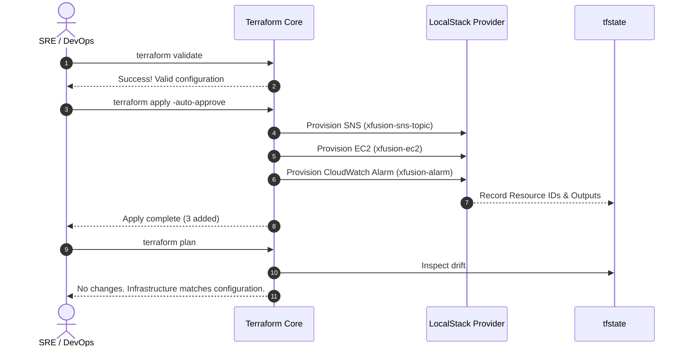

# Architecture Blueprint: EC2 CPU Anomaly Detection & Alerting Pipeline

> **Scope**: Terraform-provisioned observability pipeline running locally against LocalStack / AWS Core.
> **Design Strategy**: Decoupled, event-driven telemetry and alert dispatch.

---

## System Topology

```mermaid
flowchart LR
    subgraph Compute ["Compute Tier"]
        EC2["EC2 Instance\n(xfusion-ec2)\nami-0c02fb55956c7d316"]
    end

    subgraph Monitoring ["Observability Tier"]
        CW["CloudWatch Metric Alarm\n(xfusion-alarm)\nNamespace: AWS/EC2\nMetric: CPUUtilization"]
    end

    subgraph Messaging ["Pub/Sub Alerting Tier"]
        SNS["SNS Topic\n(xfusion-sns-topic)"]
        SUB["Downstream Consumers\n(Email / PagerDuty / SRE)"]
    end

    EC2 -- "Emits Telemetry (300s avg)" --> CW
    CW -- "State: ALARM (CPU >= 90%)" --> SNS
    SNS --> SUB

    classDef aws fill:#FF9900,stroke:#232F3E,stroke-width:2px,color:#fff;
    classDef monitor fill:#E7157B,stroke:#232F3E,stroke-width:2px,color:#fff;
    classDef msg fill:#CC2264,stroke:#232F3E,stroke-width:2px,color:#fff;

    class EC2 aws;
    class CW monitor;
    class SNS,SUB msg;
````

## ⚡ Alert State Transition Logic


```mermaid
stateDiagram-v2
    [*] --> OK : Metric Initialized

    state OK {
        description : CPU < 90% (Average over 300s)
    }

    state ALARM {
        description : CPU >= 90% (1 Consecutive 300s window)
    }

    state INSUFFICIENT_DATA {
        description : Missing metrics or instance stopped
    }

    OK --> ALARM : Threshold Exceeded (Period: 300s)
    ALARM --> OK : CPU Drops < 90%
    OK --> INSUFFICIENT_DATA : No data received
    ALARM --> INSUFFICIENT_DATA : No data received
    INSUFFICIENT_DATA --> OK : Metrics healthy

    note right of ALARM
        Triggers: aws_cloudwatch_metric_alarm.alarm_actions
        Dispatches payload to: arn:aws:sns:...:xfusion-sns-topic
    end note
```

## 📐 Component Matrix & Parameters

|**Component**|**Logical ID**|**Physical / Resource Name**|**Primary Specification**|
|---|---|---|---|
|**Pub/Sub**|`aws_sns_topic.xfusion_sns`|`xfusion-sns-topic`|Notification Target|
|**Compute**|`aws_instance.xfusion_ec2`|`xfusion-ec2`|AMI: `ami-0c02fb55956c7d316`, Type: `t2.micro`|
|**Monitor**|`aws_cloudwatch_metric_alarm.xfusion_alarm`|`xfusion-alarm`|Threshold: `>= 90%`, Period: `300s`, Eval: `1`|

## 📦 IaC Artifact Layout

```
/home/bob/terraform/
├── provider.tf        # Pre-configured LocalStack mock endpoint (http://aws:4566)
├── main.tf            # Core declarative definitions (Compute + Observability + PubSub)
└── outputs.tf         # Pipeline validation endpoints (Instance Name & Alarm Name)
```

## 🔧 Infrastructure Declarations

### `main.tf`


```terraform
resource "aws_sns_topic" "xfusion_sns" {
  name = "xfusion-sns-topic"
}

resource "aws_instance" "xfusion_ec2" {
  ami           = "ami-0c02fb55956c7d316"
  instance_type = "t2.micro"

  tags = {
    Name = "xfusion-ec2"
  }
}

resource "aws_cloudwatch_metric_alarm" "xfusion_alarm" {
  alarm_name          = "xfusion-alarm"
  comparison_operator = "GreaterThanOrEqualToThreshold"
  evaluation_periods  = 1
  metric_name         = "CPUUtilization"
  namespace           = "AWS/EC2"
  period              = 300
  statistic           = "Average"
  threshold           = 90
  alarm_description   = "Alarm triggered when CPU exceeds 90% for one 5-minute period"
  alarm_actions       = [aws_sns_topic.xfusion_sns.arn]

  dimensions = {
    InstanceId = aws_instance.xfusion_ec2.id
  }
}
```

### `outputs.tf`


```terraform
output "KKE_instance_name" {
  description = "Name of the EC2 instance"
  value       = aws_instance.xfusion_ec2.tags["Name"]
}

output "KKE_alarm_name" {
  description = "Name of the CloudWatch alarm"
  value       = aws_cloudwatch_metric_alarm.xfusion_alarm.alarm_name
}
```

## 🛡️ Deployment & Verification Flow




## 🔍 Validation Runbook


```bash
# 1. State Drift Zero Check
terraform plan

# 2. Output Schema Check
terraform output
# Expected:
# KKE_alarm_name    = "xfusion-alarm"
# KKE_instance_name = "xfusion-ec2"

# 3. Live Alarm Audit
aws --endpoint-url=http://aws:4566 cloudwatch describe-alarms \
  --alarm-names xfusion-alarm \
  --query "MetricAlarms[*].[AlarmName,MetricName,Threshold,Period,AlarmActions[0]]" \
  --output table
```
